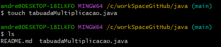

# Java
Autor: André Luiz Barbosa (@Andrehlb)
# Escreva um programa que informa a tabuada de multiplicação de um número informado pelo usuário (entre 1-10) - (by Ada Tech) 

Exemplo:
(entrada) Entre com um número de 1 a 10: 1
A tabuada de 1 é: 1 x 1 = 1 1 x 2 = 2 1 x 3 = 3

Para a criação deste código será usada a estrutura de repetição <for>

sintax do for: 

for (int i=0; i < 10; i++) {}

aonde:

 i = 0 é o início
 i < 10 é o fim
 i++ é o incremento,
 o i++ equivale a i++ = i + 1
 se i = 0, então i++ = 0 + 1 = 1
 se i = 1, então i++ = 1 + 1 = 2
 se i = 2, então i++ = 2 + 1 = 3 e assim por diante...
 até o valor 9, isto é i < 10

 Esta é a lógica da estrutura do incremento.

Observando a sintaxe, for (int i=0; i < 10; i++) {}
com o i tem-se um laço. A variável i é usada como base de apoio do laço (da estrutura de repetição).

para exibir o conteúdo da variável i (o resultado) tem que usar o <println(i)>
para capturar o valor, de forma concatenada, usar <println(valor + " x " + i + " = " + (valor * i))>
vai mostrar 10 vezes o valor e (+) o incremento i e (+) o resultado da tabuada (valor * i).

# Create file using GitBash:

Using GitBash command touch to create a file

$ touch <filename.extension>

